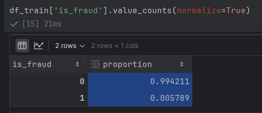
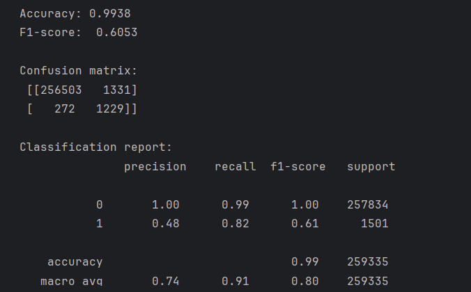
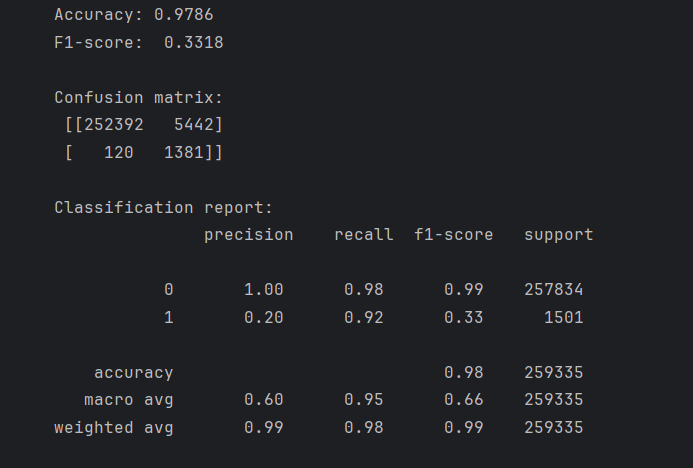
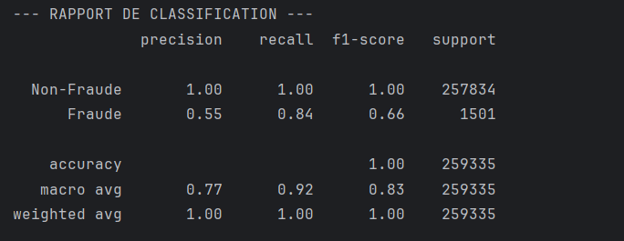

Beaucoup de point sur EDA (traitement de la données).

Il faut un modéle de machine superviser et un modéle de machine non-superviser

On a un échantillonnage de données très déséquilibrées

on va utilise

2. Le F1-ScoreLe F1-Score est la moyenne "intelligente" (harmonique) entre deux concepts clés : la Précision et le Rappel.La Précision (Precision) : Sur toutes les alertes que j'ai lancées, combien étaient de vraies fraudes ?$$\text{Précision} = \frac{VP}{VP + FP}$$Le Rappel (Recall) : Sur toutes les fraudes qui existaient, combien j'en ai attrapées ?$$\text{Rappel} = \frac{VP}{VP + FN}$$Le calcul du F1-Score :$$F1 = 2 \times \frac{\text{Précision} \times \text{Rappel}}{\text{Précision} + \text{Rappel}}$$Pourquoi c'est utile ? Si tu décides de ne rien prédire comme fraude, ton Rappel tombe à 0. Si tu prédis que tout est une fraude, ta Précision tombe proche de 0. Le F1-Score te force à être bon sur les deux tableaux.3. Le PR AUC (Precision-Recall Area Under the Curve)C'est souvent la métrique la plus robuste pour ton cas (déséquilibre extrême).Un modèle ne donne pas juste "Oui" ou "Non", il donne une probabilité (ex: 0.85 de chance que ce soit une fraude). Pour décider si c'est une fraude, tu choisis un seuil (par défaut 0.5).Si tu baisses le seuil (ex: 0.1), tu attrapes plus de fraudeurs (Rappel monte), mais tu bloques plein d'innocents (Précision baisse).Si tu montes le seuil (ex: 0.9), tu ne bloques que les cas ultra-certains (Précision haute), mais tu rates beaucoup de fraudeurs (Rappel baisse).Le calcul du PR AUC :On fait varier le seuil de 0 à 1.Pour chaque seuil, on calcule la Précision et le Rappel.On trace une courbe avec le Rappel en X et la Précision en Y.L'AUC (Aire sous la courbe) est la surface totale sous cette ligne. Plus elle est proche de 1, plus ton modèle est performant.

Pour le projet utiliser: PR AUC (Precision-Recall Area Under the Curve)

1. Paramètres Généraux (Le moteur)
Ils définissent quel type de modèle on utilise (généralement des arbres).

booster : Le type de modèle. Par défaut gbtree (arbres de décision). On peut aussi utiliser gblinear.

n_jobs : Pour définir le nombre de cœurs de ton processeur utilisés pour l'entraînement (met -1 pour utiliser toute la puissance).

2. Paramètres de Structure (Booster Parameters)
Ce sont les plus importants. Ils contrôlent comment chaque arbre est construit.

eta (ou learning_rate) : Le pas d'apprentissage. Plus il est petit (ex: 0.01), plus le modèle est robuste, mais plus il faut de n_estimators.

n_estimators : Le nombre total d'arbres que tu vas construire.

max_depth : Profondeur maximale d'un arbre (on en a parlé : 3 à 10 en général).

min_child_weight : Définit la "pureté" minimale requise pour créer un nouveau nœud. Très utile pour gérer le déséquilibre : si tu l'augmentes, tu empêches le modèle de créer des règles pour des cas trop isolés.

gamma : Un paramètre de régularisation qui définit la perte minimale nécessaire pour faire une division supplémentaire dans l'arbre.

3. Paramètres de Robustesse (Stochasticity)
Pour éviter que le modèle ne devienne "paresseux" ou ne sur-apprenne.

subsample : Pourcentage de lignes utilisées pour chaque arbre.

colsample_bytree : Pourcentage de colonnes (features) utilisées pour chaque arbre.

colsample_bylevel : Pourcentage de colonnes utilisées à chaque niveau de profondeur de l'arbre.

4. Paramètres de Régularisation (Le frein à main)
Ils servent à punir la complexité excessive du modèle pour éviter l'overfitting.

lambda (L2 regularization) : Encourage les poids des feuilles à être petits.

alpha (L1 regularization) : Peut rendre certains poids nuls (utile si tu as énormément de variables et que tu veux en "ignorer" certaines).

5. Paramètres Spécifiques au Déséquilibre (Ton cas 1% / 99%)
scale_pos_weight : Comme expliqué, il donne plus de poids à la classe minoritaire.

max_delta_step : En cas de déséquilibre extrême (encore plus que le tien), ce paramètre aide à la convergence en limitant l'ampleur des mises à jour des poids. On le règle souvent entre 1 et 10.

Meilleurs paramètres trouvés : {'model__colsample_bytree': 0.8, 'model__learning_rate': 0.1, 'model__max_depth': 5, 'model__min_child_weight': 1, 'model__n_estimators': 300, 'model__scale_pos_weight': 10, 'model__subsample': 0.8}

# Sauvegarde simple avec seuil
joblib.dump(random_search.best_estimator_, 'random_forest_pure.pkl')

# Utilisation en production
model = joblib.load('random_forest_pure.pkl')
seuil_expert = 0.9

def prediction_service(data):
    prob = model.predict_proba(data)[:, 1]
    return (prob >= seuil_expert).astype(int)